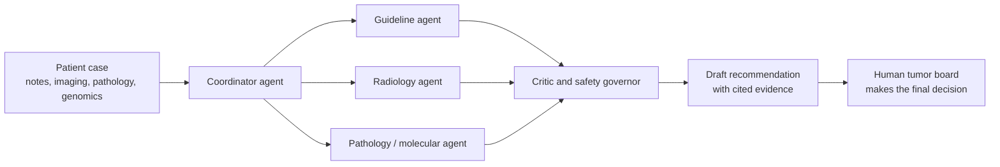

# 🩺 Awesome Virtual Tumor Board
### Multi-Agent AI for Clinical Oncology Decision-Making

**What happens when a tumor board is staffed by a team of specialist AI agents, and how do we know if we can trust it?**

*A hand-verified, audit-tested reading list on LLM-based multi-agent systems that support or simulate multidisciplinary tumor boards.*

---

## Why this repo exists

Tumor boards save lives, but they are slow, scarce, and hard to scale. Virtual tumor boards fixed *where* experts meet. They did not fix *how much* a physician has to read before the meeting starts. LLM agents that take on roles (guideline retrieval, radiology summary, molecular interpretation, safety review) are the newest attempt at that problem, and the literature around them is growing fast and unevenly.

This repository is an attempt to make that literature navigable **and trustworthy**. Every paper here was checked against a primary source. The collection also documents what went wrong when an AI wrote the first draft of the bibliography.

> **The twist:** the first version of this reading list was written by an AI (Gemini 3.1 Pro). I audited its references. None were fabricated, but **3 of 7 had silently stripped metadata** (missing authors, year, venue, DOI). A "does this paper exist?" check would have passed all of them. [See the audit](citation-audit/Citation_Integrity_Audit.pdf).

## At a glance

| | |
|---|---|
| 📄 Verified papers | **24**, in 4 categories |
| 🗂️ Datasets | **4** (MedQA, PubMedQA, MIMIC-IV, AgentClinic) |
| 🧰 Tools & frameworks | **5** (AutoGen, CrewAI, LangGraph, MedAgents, MDAgents) |
| 💻 GitHub implementations | **5** official repos |
| 🎓 Tutorials | **5** |
| 🔍 Citation audit | **7 AI-generated refs checked → 4 verified, 3 corrected, 0 fabricated** |
| ✍️ Original work | AI-assisted paper, citation audit, literature review, final LaTeX paper |

## Contents

- [The idea in one picture](#the-idea-in-one-picture)
- [Overview](#overview)
- [Repository map](#repository-map)
- [AI-Assisted Research Paper](#ai-assisted-research-paper)
- [Citation Integrity Audit](#citation-integrity-audit)
- [Foundational MDT Literature](#foundational-multidisciplinary-tumor-board-mdt-literature)
- [Foundational Multi-Agent AI Frameworks](#foundational-multi-agent-ai-frameworks)
- [Evaluation and Benchmarks](#evaluation-and-benchmarks)
- [Applications: AI-Orchestrated Virtual Tumor Boards](#applications-ai-orchestrated-virtual-tumor-boards--multi-agent-oncology-systems)
- [Corrected References From the AI-Generated Paper](#corrected-references-from-the-ai-generated-paper-audited-in-lab-1)
- [Datasets](#datasets)
- [Tools and Libraries](#tools-and-libraries)
- [GitHub Implementations](#github-implementations)
- [Tutorials and Learning Resources](#tutorials-and-learning-resources)
- [License](#license)

## The idea in one picture

A conceptual sketch of the architecture pattern shared by several systems listed below (for example the coordinator/reviewer design in the JCO work and the critic plus safety governor in TumorBoard). It is not the design of any single paper.

## Overview

Multidisciplinary Tumor Boards (MDTs) are the clinical gold standard for cancer care, bringing together medical oncologists, radiation oncologists, surgeons, pathologists, and radiologists to synthesize treatment plans. They are also resource-intensive and geographically constrained, which drove the shift toward telecommunication-based Virtual Tumor Boards (VTBs). That shift solved logistical barriers but did not reduce the cognitive load on physicians reviewing complex, multi-modal patient data.

This repository focuses on the next stage of that evolution: **Multi-Agent AI Systems (MAS)** that orchestrate specialized LLM agents, each modeling a distinct clinical role or task (guideline retrieval, radiology summarization, molecular interpretation, treatment planning, safety review), to simulate the collaborative deliberation of a real tumor board rather than relying on a single, isolated LLM. The collection spans the foundational human-MDT literature that motivates this work, the general-purpose multi-agent LLM frameworks it builds on, benchmarks for evaluating clinical multi-agent systems, and the growing body of applied virtual-tumor-board deployments and pilot studies in oncology (thoracic, neuro-oncology, gastric, head & neck, and hematologic malignancies).

Every paper in this collection was independently verified against a primary scholarly source (journal publisher page, PubMed/PMC, arXiv abstract page, ACL Anthology, or conference proceedings), not accepted on the strength of an AI-generated citation.

## Repository map

| Folder | What's inside |
|---|---|
| [`paper/`](paper) | The AI-assisted scoping review (Lab 1) |
| [`citation-audit/`](citation-audit) | Full citation-integrity audit and the prompt / paper-pool workbook |
| [`references/`](references/references.md) | Annotated bibliography with the full verified metadata |
| [`datasets/`](datasets/datasets.md) · [`tools/`](tools/tools.md) · [`implementations/`](implementations/github-repositories.md) | Curated resource lists |
| [`lit-review/`](lit-review) | Tool-assisted literature review (ResearchRabbit, Litmaps, Semantic Scholar, Elicit): scope, prompt log, tool comparison, literature set, ResearchRabbit exports and map |
| [`orchestrating_vtb_acm_csur/`](orchestrating_vtb_acm_csur) | ACM-style LaTeX source of the final comparative review |
| [`VibhumSharma_RSI2026506/`](VibhumSharma_RSI2026506) | Final submission package: Prism/Overleaf papers, prompt log, error log, reflection, verification checklists |
| [`assigned/`](assigned) | The original lab briefs this repo grew out of |

## AI-Assisted Research Paper

**Orchestrating the Virtual Tumor Board: A Scoping Review of Multi-Agent AI and Collaborative Decision-Making in Clinical Oncology**

An AI-assisted scholarly review (generated with Google Gemini 3.1 Pro) surveying the transition from single-agent to multi-agent AI systems in oncology decision support, covering current approaches, fidelity assessments, and critical limitations around data bias, accountability, and real-world clinical deployment.

📄 [Read the paper](paper/AI_Assisted_Research_Paper.pdf)

**Follow-up (human-led):** *Orchestrating the Virtual Tumor Board: A Comparative Literature Review of AI- and Multi-Agent-Assisted Oncology Decision Support*, the final paper built from the verified literature in this repo. 📄 [Read the final paper](VibhumSharma_RSI2026506/Overleaf_Final_Paper.pdf) · [LaTeX source](orchestrating_vtb_acm_csur/main.tex)

## Citation Integrity Audit

All 7 references originally generated by the AI for the paper above were independently audited against primary scholarly sources (PubMed, Crossref DOI resolver, ASCO Publications, Springer, and journal publisher sites) rather than accepted at face value.

| Verified (A) | Wrong metadata (B) | Fabricated (D) | Authenticity score | Prediction accuracy |
|:-:|:-:|:-:|:-:|:-:|
| **4** | **3** | **0** | **89.3 / 100** | **57.1 %** |

**The lesson:** the AI's most sparsely formatted citations (missing authors, year, journal, DOI) were the ones I predicted were fake. All three were real papers with silently stripped metadata, which is why prediction accuracy landed at 57.1 %. The most serious problem was not fabrication but **metadata stripping on real, verifiable papers**, a failure a casual existence check does not catch.

🔎 [View the full audit](citation-audit/Citation_Integrity_Audit.pdf)

## Foundational Multidisciplinary Tumor Board (MDT) Literature

*Why tumor boards matter, and the human baseline any AI board has to beat.*

- **Tumour boards and their quality of structures, processes, and team performance in multidisciplinary cancer care: a systematic review**: 2026 systematic review synthesizing 97 studies on MDT structure and process quality. [Paper](https://link.springer.com/article/10.1186/s12913-026-14447-9)
- **Process quality of decision-making in multidisciplinary cancer team meetings: a structured observational study**: Direct process-quality measurement of real human MDT meetings. [Paper](https://pmc.ncbi.nlm.nih.gov/articles/PMC5693525/)
- **Higher number of multidisciplinary tumor board meetings per case leads to improved clinical outcome**: *BMC Cancer*, 2020; links MDT frequency to overall survival across 454 matched patients. [Paper](https://bmccancer.biomedcentral.com/articles/10.1186/s12885-020-06809-1)
- **The impact of tumor board on cancer care: evidence from an umbrella review**: Umbrella review of 5 reviews (147 studies) on outcomes of tumor board discussion. [Paper](https://www.ncbi.nlm.nih.gov/pmc/articles/PMC6995197/)
- **Virtual multi-institutional tumor board: a strategy for personalized diagnoses and management of rare CNS tumors**: Rogers et al., *J Neuro-Oncology*, 2024; the direct non-AI institutional predecessor of AI-orchestrated VTBs. [Paper](https://www.ncbi.nlm.nih.gov/pmc/articles/PMC11023967/)

## Foundational Multi-Agent AI Frameworks

*The general-purpose agent machinery that clinical systems are built on.*

- **AutoGen: Enabling Next-Gen LLM Applications via Multi-Agent Conversation Framework**: Wu et al., Microsoft Research, COLM 2024. [Paper (arXiv:2308.08155)](https://arxiv.org/abs/2308.08155)
- **MedAgents: Large Language Models as Collaborators for Zero-shot Medical Reasoning**: Tang et al., Findings of ACL 2024. [Paper (arXiv:2311.10537)](https://arxiv.org/abs/2311.10537)
- **MDAgents: An Adaptive Collaboration of LLMs for Medical Decision-Making**: Kim et al., NeurIPS 2024. [Paper (arXiv:2404.15155)](https://arxiv.org/abs/2404.15155)

## Evaluation and Benchmarks

*How do you even grade an AI tumor board?*

- **AgentClinic: a multimodal agent benchmark to evaluate AI in simulated clinical environments**: Schmidgall et al., 2024. [Paper (arXiv:2405.07960)](https://arxiv.org/abs/2405.07960)
- **MTBBench: A Multimodal Sequential Clinical Decision-Making Benchmark in Oncology**: 2025. [Paper (arXiv:2511.20490)](https://arxiv.org/pdf/2511.20490)

## Applications: AI-Orchestrated Virtual Tumor Boards & Multi-Agent Oncology Systems

*From guideline Q&A to live hospital deployments.*

- **Virtual oncology collaborative tumor board using multiple artificial intelligence agents**: Wang, Mullick Chowdhury & Nazha, *JCO* 43, 1563 (2025 ASCO abstract). [Paper](https://ascopubs.org/doi/10.1200/JCO.2025.43.16_suppl.1563)
- **Tumor Board–Inspired Multiagent Artificial Intelligence System for Interpreting Oncology Guidelines**: *JCO Clinical Cancer Informatics*, Jan 2026; full peer-reviewed follow-up, 94% / 90% accuracy, outperforms GPT-4o, Claude 3.7 and Gemini 2.5. [Paper](https://ascopubs.org/doi/10.1200/CCI-25-00286)
- **Development, Evaluation, and Deployment of a Multi-Agent System for Thoracic Tumor Board**: Ellis-Caleo et al., Stanford Medicine, 2026; a real clinical deployment with post-deployment monitoring. [Paper (arXiv:2604.12161)](https://arxiv.org/abs/2604.12161)
- **VISTA Architect: A graph database-oriented health AI system demonstrated in multidisciplinary tumor boards**: Stanford Medicine, 2026; 96.4% accuracy across 1,180 patients. [Paper (arXiv:2606.22692)](https://arxiv.org/abs/2606.22692)
- **TumorBoard: Evidence-Grounded Multi-Agent Decision Support for Longitudinal Neuro-Oncology**: 2026; specialist agents plus an adversarial critic and safety governor. [Paper (arXiv:2608.03190)](https://arxiv.org/abs/2608.03190)
- **Artificial intelligence-driven virtual tumor board enhances precision care in myelodysplastic syndromes**: medRxiv preprint, 2026; multi-agent "Virtual MDS Panel" rated by 9 blinded international experts. [Paper](https://www.medrxiv.org/content/10.64898/2026.03.26.26349088.full.pdf)
- **Simulating a virtual tumor board with large language models: a pilot study in NSCLC patients receiving immunotherapy**: Ismayilov et al., *Immunotherapy*, 2025. [Paper](https://pubmed.ncbi.nlm.nih.gov/41190886/)
- **EvoMDT: a self-evolving multi-agent system for structured clinical decision-making in multi-cancer**: Liu et al., *npj Digital Medicine* 9(1), 124 (2026). [Paper](https://doi.org/10.1038/s41746-025-02304-8)

## Corrected References From the AI-Generated Paper (Audited in Lab 1)

*The seven citations the AI got (partly) wrong, now with verified metadata. Some appear above as well.*

- **Enhancing Adoption and Utility of Virtual Tumor Boards: Impact on Community and Rural Oncology Practices**: Powell et al., *JCO Oncology Practice*, 2021. [Paper](https://doi.org/10.1200/OP.20.00480)
- **The Emergence of Virtual Tumor Boards in Neuro-Oncology: Opportunities and Challenges**: Ekhator et al., *Cureus*, 2022. [Paper](https://doi.org/10.7759/cureus.25682)
- **National Cancer Grid Virtual Tumor Boards of Head and Neck Cancers: An Innovative Approach to Multidisciplinary Care**: Thiagarajan et al., *JCO Global Oncology*, 2023. [Paper](https://doi.org/10.1200/GO.22.00348)
- **The Fidelity of Artificial Intelligence to Multidisciplinary Tumor Board Recommendations for Patients with Gastric Cancer**: Park & Chae, *J Gastrointestinal Cancer*, 2024. [Paper](https://doi.org/10.1007/s12029-023-00967-8)
- **Artificial intelligence in multidisciplinary tumor boards enhancing decision making and clinical outcomes in oncology**: Wang et al., *iScience*, 2025 (author list corrected per audit). [Paper](https://doi.org/10.1016/j.isci.2025.114082)
- **Multidisciplinary tumor board decisions and AI-generated recommendations in general surgery**: Deniz et al., *Updates in Surgery*, 2026 (author list corrected per audit). [Paper](https://doi.org/10.1007/s13304-026-02749-w)
- **EvoMDT** (listed under Applications above): full author list and venue restored per audit.

## Datasets

See [`datasets/datasets.md`](datasets/datasets.md): MedQA, PubMedQA, MIMIC-IV, and the AgentClinic multi-agent benchmark suite.

> **Heads-up:** no open dataset of real tumor-board deliberations exists. The four above are the closest verifiable substitutes for benchmarking clinical multi-agent reasoning. The reasoning is in the file.

## Tools and Libraries

See [`tools/tools.md`](tools/tools.md): AutoGen, CrewAI, LangGraph, MedAgents, and MDAgents.

## GitHub Implementations

See [`implementations/github-repositories.md`](implementations/github-repositories.md): official AutoGen, MedAgents, MDAgents, AgentClinic, and CrewAI repositories.

## Tutorials and Learning Resources

- **[AutoGen Documentation](https://microsoft.github.io/autogen/)**: Official multi-agent conversation framework docs, including group-chat and role-based agent patterns directly applicable to tumor-board orchestration.
- **[MedAgents GitHub README](https://github.com/gersteinlab/MedAgents)**: Setup and usage guide for the role-playing, multi-round medical LLM collaboration pipeline.
- **[MDAgents GitHub README](https://github.com/mitmedialab/MDAgents)**: Usage guide for the adaptive solo/group medical LLM collaboration framework.
- **[AgentClinic Tutorials](https://github.com/SamuelSchmidgall/AgentClinic)**: Includes a walkthrough for building custom multi-agent clinical simulation cases.
- **[CrewAI Documentation](https://docs.crewai.com/)**: Guide to defining role-based agent "crews", transferable to modeling distinct clinical specialties as collaborating agents.

## License

Code and original written content in this repository (the AI-assisted paper, citation audit, literature review, and this README) are shared under the [MIT License](LICENSE) unless otherwise noted. Linked third-party papers, datasets, and tools retain their own original licenses; consult each source directly before reuse. No copyrighted third-party paper PDFs are hosted in this repository; all scholarly works are linked to their official DOI, arXiv, or publisher page.

---

*Maintained by [Vibhum Sharma](https://github.com/vibhum-phd), Ph.D. scholar (IT), IIIT Allahabad.*
*Found a wrong author, a dead link, or a paper that belongs here? Open an issue.*

