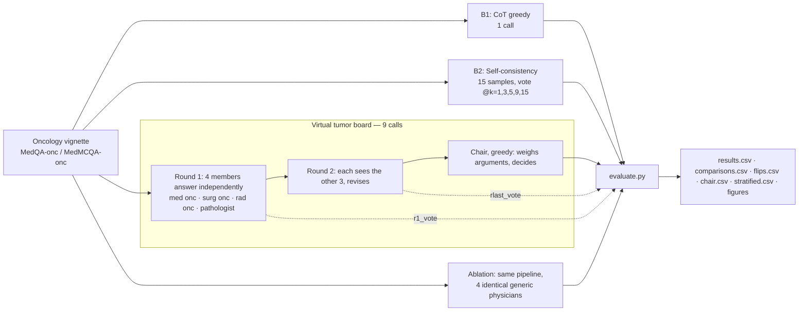

# Experiment architecture (protocol v1.0)

```mermaid
flowchart LR
  Q[Oncology vignette<br/>MedQA-onc / MedMCQA-onc] --> COT[B1: CoT greedy<br/>1 call]
  Q --> SC[B2: Self-consistency<br/>15 samples, vote @k=1,3,5,9,15]
  Q --> R1
  subgraph BOARD[Virtual tumor board — 9 calls]
    R1[Round 1: 4 members answer independently<br/>med onc · surg onc · rad onc · pathologist] --> R2[Round 2: each sees the other 3, revises]
    R2 --> CH[Chair, greedy: weighs arguments, decides]
  end
  Q --> G[Ablation: same pipeline,<br/>4 identical generic physicians]
  COT --> E[evaluate.py]
  SC --> E
  CH --> E
  R1 -. r1_vote .-> E
  R2 -. rlast_vote .-> E
  G --> E
  E --> O[results.csv · comparisons.csv · flips.csv · chair.csv · stratified.csv · figures]
```

Same backbone, instruction, temperature, top-p and max tokens for every arm. Primary test: board final vs SC@9 (call-matched), exact McNemar + ≥2 pp.
